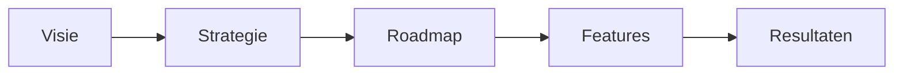
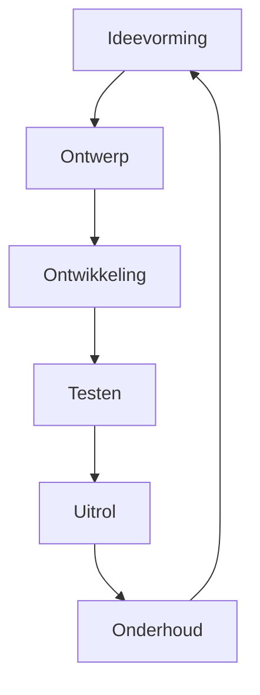
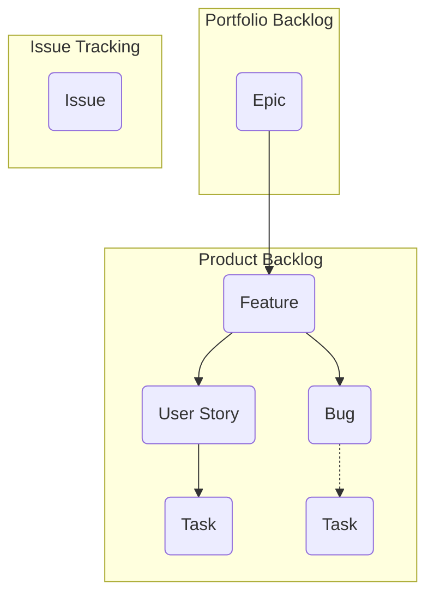
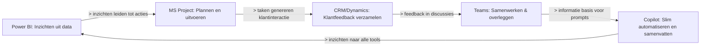
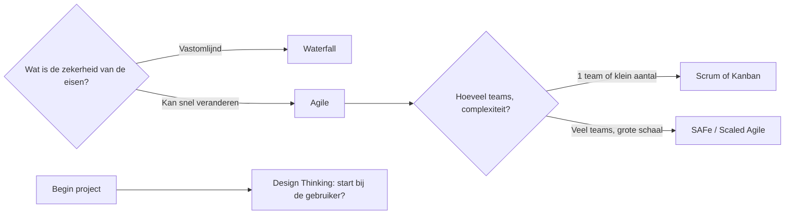

# Inleiding tot productbeheer

## De rol van de productmanager en het belang van productmanagement

Stel je even voor: je werkt bij een bedrijf als Microsoft, Google, of een snelgroeiende startup. Je ziet dat sommige softwaretools (zoals Teams of Outlook) naadloos samenwerken, waardoor je makkelijker vergadert, documenten deelt, en met je team werkt. Je loopt misschien tegen frustraties aan in je eigen werk – iets dat handiger, sneller of slimmer zou kunnen. Maar… wie zorgt er nou eigenlijk voor dat zulke tools perfect inspelen op de behoeften van gebruikers én tegelijk het bedrijfsdoel dienen? Dat is typisch het werk van een productmanager.

### Waarom bestaat productmanagement eigenlijk?

Voordat we in de rol zelf duiken: waarom hebben bedrijven überhaupt productmanagers nodig? Wat zou er gebeuren als deze functie er niet was?

- Stel: een softwarebedrijf laat alleen ontwikkelaars bepalen wat ze bouwen. Dan zou je veel features krijgen waar misschien wel technisch interessante dingen in zitten, maar waar geen gebruiker op zat te wachten. Of de sales-afdeling stuurt alles: dan wordt het product misschien wel aantrekkelijk gepresenteerd, maar mist het fundamentele gebruikersgemak. Of management beslist alles: dan is de kans groot dat het product niet aansluit bij wat klanten écht nodig hebben.
- Kortom: zonder iemand die continu de brug slaat tussen gebruikerswensen, technische mogelijkheden én bedrijfsstrategie, raakt het product snel uit koers. Je bouwt ofwel nutteloze features ("nice to have"), je mist de boot op trends, of je verliest het contact met je klant.

Snap je al waarom productmanagement bestaat? Het is ontstaan omdat je iemand nodig hebt die het hele plaatje overziet én richting geeft aan het product — van eerste idee tot succes in de markt. Denk hier dus niet aan "iemand die to-do-lijstjes maakt", maar juist aan de architect en gids van het product.

### De rol van de productmanager: bruggenbouwer, strateeg, probleemoplosser

Laten we het nu concreet maken: stel je bent productmanager bij een bedrijf dat een communicatie-app biedt, zoals Microsoft Teams. Je dag start met kijken: welke feedback komt er binnen van gebruikers? Lopen mensen vast op het plannen van meetings? Is de chatfunctie onduidelijk? Deze signalen, samen met data (hoe vaak wordt functie X gebruikt, waar haken mensen af), geven je richting.

Als productmanager ben jij de verbindende schakel:

- Voor het management leg je uit hoe jouw product bijdraagt aan de bedrijfsdoelen.
- Met ontwikkelaars en ontwerpers vertaal je wensen van gebruikers naar technische oplossingen.
- Je checkt bij sales en marketing waar klanten naar vragen of waar concurrenten mee komen.
- Je bewaakt dat het product relevant blijft: vandaag, morgen en komend jaar.

Dit betekent dus nooit alleen maar "features bedenken", maar vooral prioriteren: wát bouwen we, waarom, en wanneer? Waar heeft de gebruiker écht wat aan, en wat levert het bedrijf op?

#### Voorbeeld uit de praktijk

Stel: gebruikers willen makkelijker vergaderingen inplannen vanuit Teams, en je hoort van je supportafdeling dat veel mensen foutmeldingen krijgen bij het synchroniseren met hun agenda. Je onderzoekt gebruikersdata, praat met het ontwikkelteam, én stemt met marketing af wat er gecommuniceerd kan worden. Misschien besluit je: we bouwen als eerst een functie die Teams en Outlook automatisch synchroniseert, en geven deze prioriteit in de roadmap. Maar: je moet dit niet alleen technisch mogelijk maken, je beheert ook de communicatie en je zorgt dat álle betrokkenen snappen waarom deze stap belangrijk is.

### De kerncompetenties: wat moet je als productmanager kunnen?

Je merkt het al: de productmanager is geen solist, maar een soort dirigent die verschillende partijen op één lijn krijgt. Dus wat heb je daarvoor nodig? Laten we op hoofdlijnen kijken naar de vier fundamenten, met telkens een concreet voorbeeld.

#### 1. Productvisie

Stel je voor dat je werkt aan een logistiek platform. De productvisie is dan niet "nog een app voor pakketjes", maar iets als: "een naadloze, duurzame wereldwijde toeleveringsketen". Dit is het kompas van het hele team — een inspirerend, maar realistisch doel waar iedereen zich achter kan scharen.

Zo'n visie helpt je keuzes maken: past een nieuwe feature daarbij? Helpt het de klant écht, en draagt het bij aan het grotere doel?

> Snap je waarom die visie zo belangrijk is? Zonder heldere productvisie raak je als team makkelijk de focus kwijt. Iedereen blijft leuke ideetjes aanbrengen, maar je mist samenhang en richting.

#### 2. Productstrategie

Ná de visie komt de vraag: HOE gaan we dat doel bereiken? Stel, je streamingplatform kiest ervoor om in te zetten op eigen series, omdat uit marktonderzoek blijkt dat gebruikers daarom blijven. Je productstrategie beschrijft dan: op welk segment richt je je, wat maakt jouw product uniek, hoe breng je het naar de markt, hoe groei je verder?

Strategie is dus veel meer dan "de volgende feature", het is het overkoepelende plan om van A naar B te komen — aangepast aan de markt, concurrenten en de veranderende klantbehoeften.

#### 3. Roadmap

Dit is je actieplan: welke grote stappen gaan we wanneer zetten? Denk aan een tijdlijn met blokken "MVP lancering", "gebruikersgroei", "monetisatie". De roadmap houdt iedereen bij de les — en is nooit in beton gegoten. Verandert de markt? Komt er nieuwe gebruikersfeedback? Dan pas je de roadmap aan.

Visueel kun je dat als volgt voorstellen:

> Zie je hoe visie, strategie en roadmap in elkaar grijpen? Je bouwt niet zomaar iets — je bewaakt continu de samenhang tussen het grote doel, de manier om er te komen, en de concrete acties.

#### 4. Resultaatmeting

> Dit klinkt misschien vaag: "succes meten". Maar denk eens aan je eigen ervaring met een app. Wanneer is het product nou écht een succes? Als véél mensen het gebruiken? Als gebruikers blijven terugkomen? Als ze enthousiast zijn bij support?

Als productmanager definieer je vooraf wat jij als succes ziet: dat kan 'aantal nieuwe gebruikers', 'het percentage dat een nieuwe feature gebruikt', of 'de gemiddelde klantwaardering' zijn. Dit zijn je KPI’s — ze zorgen dat je niet op gevoel stuurt, maar op feiten.

Bijvoorbeeld: stel je voert een nieuwe functie door, en je meet daarna hoeveel mensen die functie gebruiken of hoe snel mensen nu een taak kunnen afronden. Zie je verbetering? Dan heeft je ingreep gewerkt.

### Vaardigheden en mindset: wat verwacht de praktijk?

Als productmanager combineer je dus strategisch inzicht met sterke communicatie. Je moet data kunnen lezen, kansen in de markt herkennen, én kunnen omgaan met weerstand ("waarom zouden we dát bouwen?"). Je bent de schakel tussen gebruikers, techniek en business.

Wat je helpt in deze rol:

- Nieuwsgierigheid (de 'waarom'-vraag stellen)
- Probleemoplossend denken
- Analytisch vermogen (data écht snappen)
- Samenwerken (door de hele organisatie)
- Lef: durven kiezen, ook als niet iedereen het met je eens is
- Aanpassingsvermogen: technologie en markten veranderen snel

> Zullen we het straks eens bekijken hoe dit werkt in de context van bedrijfssoftware, AI en cloudproducten? Want hoewel de basis van productmanagement vaak gelijk is, brengen die sectoren unieke uitdagingen met zich mee. Daar gaan we in deel 2 verder op in.

### Een dag uit het leven van een productmanager: praktijkmomenten

Laat ik je meenemen in hoe een doorsneedag eruitziet. Dit helpt het abstracte verhaal tastbaar maken.

- Je begint je dag met het analyseren van gebruikersfeedback: "Wat vinden mensen van onze nieuwste feature?" Je checkt data: "Hoe vaak crasht onze app deze week?", of "loopt het aanmaken van accounts ergens spaak?"
- Daarna overleg je met techniek: wat zijn de grootste knelpunten? Kan een veelgevraagde feature de volgende Sprint in?
- Tussendoor geef je input aan marketing of sales: "Hoe leggen we de waarde van onze nieuwe update uit aan klanten?"
- Je werkt je roadmap bij na input van klanten, data, en je team. Moet iets worden verschoven vanwege een blocker?
- Eind van de middag stem je met je stakeholder(s) af: laat je nieuwe cijfers zien, leg je keuzes uit, en houd je iedereen aangehaakt.

Zie je hoe flexibel en breed je werk is? Je bent deels strateeg, deels communicator, deels datadenker — nooit puur uitvoerend, nooit alleen 'beheerder'. Je draagt direct bij aan het bedrijfsresultaat, omdat jouw keuzes leiden tot meer klanttevredenheid, hogere opbrengsten of slimmere processen.

### Verbondenheid met de rest van de module

Alles wat je hier leert – van de rol van de productmanager tot de kerncompetenties – is straks de fundering onder elk ander onderwerp in deze module. Waar je in het volgende onderdeel kennismaakt met specifieke uitdagingen van cloud/softwareproducten, en later met tools, processen en zelfs AI, bouw je telkens voort op het idee dat JIJ degene bent die het overzicht houdt en de richting bepaalt.

> Heb je na deze uitleg een globaal gevoel van: “ik zou snappen waarom bedrijven productmanagers inzetten?” En krijg je een idee van hoe breed, belangrijk en verbindend jouw rol kan zijn?

In het volgende deel gaan we kijken naar de unieke uitdagingen van bedrijfssoftware, cloudproducten en wat daar weer andere accenten geeft aan productmanagement!

Als we het hebben over de rol van de productmanager en waarom productmanagement belangrijk is, is het goed om direct te kijken naar wat een productmanager in de praktijk doet, welke impact je kunt hebben, en wat voor type persoon in deze functie floreert. We zoomen daarom in op vier vragen:
- Waarom is productmanagement zo belangrijk voor bedrijven?
- Hoe ziet de dagelijkse praktijk en impact van een productmanager eruit?
- Welke vaardigheden maken jou succesvol?
- Wat voor mindset of houding helpt je bij deze rol?

Hieronder gaan we dieper in op deze kernthema’s, met veel praktijkvoorbeelden en regelmatig checks of je de rode draad nog volgt.

---

Stel je voor: je werkt bij een softwarebedrijf, en je hoort in de wandelgangen vaak dat “productmanagers” essentieel zijn voor het succes van de organisatie. Maar waarom eigenlijk? Wat doe je als productmanager zélf op een doorsneedag waarmee je het verschil maakt?

### Productmanagement: meer dan alleen producten bouwen

We beginnen met een eenvoudig voorbeeld. 

Denk aan een bedrijf dat een nieuw platform wil lanceren waarmee kleine bedrijven hun projecten kunnen beheren. Zonder een goede productmanager zou iedereen zijn eigen ideeën hebben over wát er gebouwd moet worden – de developers willen technische innovatie, sales wil snel iets in de markt, marketing wil een soepel verhaal. Dit leidt snel tot chaos, misverstanden en uiteindelijk een product dat niet écht aansluit op wat klanten verwachten.

**Snap je waarom die verbindende rol, die focus op klant en markt, zo essentieel is?**

Een productmanager zorgt dus niet alleen voor ‘het volgende nieuwe ding’, maar voor een stroomlijn in proces, keuzes en richting. Het is de énige rol die écht continu kijkt: lost dit product een bestaand probleem van onze klanten op? En draagt dit bij aan het resultaat van onze organisatie?

### De zichtbare invloed van goede productmanagers

Productmanagement heeft direct impact op zowel de korte als de lange termijn:

- **Omzet en winstgevendheid:** Productmanagers analyseren markten, ontdekken kansen en zorgen ervoor dat nieuwe producten ook echt gekocht worden. Bijvoorbeeld: zie je ergens een pijngrens waar niemand in de markt op inspeelt, en weet je een product te bedenken waarvoor klanten wél willen betalen? Dan heb je direct een nieuwe inkomstenbron ontsloten.
    - Klassiek voorbeeld: een productmanager ziet dat kleine bedrijven geen fijne simpele projectentool kunnen vinden, ontwikkelt er zelf één, en zorgt dat het bedrijf daarmee een hele nieuwe groep klanten binnenhaalt.
    - **Key performance indicators, KPI’s (resultaatmeting)** zoals “kosten per klant”, of de **customer lifetime value** (totale waarde van een klant over de hele relatie), zijn heel concrete metrics die laten zien welke impact je hebt.
- **Efficiëntie en minder verspilling:** Je werkt altijd samen met andere afdelingen en let er scherp op dat ontwikkeltijd, geld en energie niet verspild worden aan onderdelen die niemand gebruikt. Bijvoorbeeld: je laat de gebruikers tests uitvoeren op een nieuwe functionaliteit, merkt dat niemand hem snapt, en schrapt hem voordat daar maanden werk in wordt gestoken.
- **Loyaliteit en merkwaarde:** Door klantfeedback te verzamelen, je producten aan te passen op gebruikerswensen en open te staan voor verbeteringen, zorg je ervoor dat klanten tevreden blijven, producten vaker gebruiken en zelfs ambassadeur worden voor jouw merk.

**Zie je nu: productmanagement is niet een luxe, maar een direct meetbare kracht achter groei, winst en klanttevredenheid?**

### Hoe ziet het werk van een productmanager er écht uit?

Laten we meteen kijken naar de dagelijkse praktijk.

Je kunt de productmanager het beste zien als een soort “regisseur” op het kruispunt van klant, business en technologie. Je zit continu tussen de teams, luistert naar wensen van gebruikers, vertaalt die naar technische oplossingen en onderhandelt over prioriteiten. Je bent het aanspreekpunt voor:

- gebruikers (wat hebben ze nodig?)
- ontwikkelaars (kan het gebouwd worden, zijn er blokkades?)
- sales en marketing (hoe verkopen we het goed, wat beloven we wel/niet?)
- management (wat levert het op, hoe past het in het grote plan?)

In de praktijk betekent dit veel: praten, onderzoeken, data analyseren, keuzes tegen elkaar afwegen en beslissingen nemen. Geen dag is hetzelfde: de ene keer ben je bezig met een diepte-interview met klanten, de andere keer sta je in een meeting om een technische uitdaging uit te leggen aan collega’s die geen developer zijn.

Concreet voorbeeld:
- Je signaleert uit klantfeedback dat gebruikers moeite hebben om dashboards aan te passen.
- Je verzamelt data uit analytics en ziet dat dit effect heeft op klanttevredenheid (KPI’s!).
- Je brengt dit probleem in kaart met het UX-team en ontwikkelaars, stelt verbeteringen voor.
- Je stemt af met sales en customer support hoe deze verbeteringen naar buiten toe worden gecommuniceerd.
- Je monitort na livegang of de cijfers op het dashboard verbeteren.

### Krachtige vaardigheden: wat maakt een productmanager succesvol?

Nu je begrijpt hóe breed de rol is, breken we die even op in vaardigheden – maar altijd met de praktijk centraal. Want het draait niet om een lange lijst buzzwoorden, maar om het vermogen om klantwaarde en bedrijfsdoelen samen te brengen.

**1. Strategisch denken:**  
Je moet het grotere plaatje zien. Bijvoorbeeld: snappen dat als je nú investeert in een bepaalde functie, je misschien later een betere positie op de markt krijgt. Of: dat je voor de productvisie (product vision) moet uitzoomen, en niet verstrikt raakt in kleine details.

**2. Communicatie:**  
Je schakelt constant tussen technisch en niet-technisch publiek. De ene keer presenteer je een **roadmap** aan het management (dus: waarom bouwen we wat, en wanneer?), de andere keer leg je in gewone taal uit aan sales waarom een bepaalde feature niet in deze release past.

**3. Leiderschap:**  
Je hebt geen directe macht over andere teams, maar moet ze wel meenemen in jouw visie en motivatie. Dit vraagt inspireren in plaats van afdwingen.

**4. Data-analyse:**  
Of je nu met je eigen ogen patronen in gebruikersdata ziet, of met een tool als Power BI werkt: je gebruikt data als basis voor beslissingen. Denk dan aan: hoeveel procent van de gebruikers haakt ergens af, waar lopen ze vast? Dat zijn signalen waar je direct op kunt sturen.

**5. Onderhandeling & samenwerking:**  
Je onderhandelt tussen wensen uit de markt, technische mogelijkheden en budgettaire grenzen. Die beroemde “projectmanagement-driehoek” (scope, tijd, budget) betekent: als je meer functies toevoegt, kost het meer tijd of geld – en omgekeerd. Die balans bewaak jij.

**6. Empathie (user empathy):**  
Je merkt snel of een idee aansluit bij de echte problemen van gebruikers. Je gaat daarom niet uit van aannames, maar van écht luisteren en goed doorvragen.

**Zou je deze skills herkennen in jezelf? Zie je hoe ze elkaar aanvullen?**

Mocht je interesse hebben in wat voor tools je voor al deze taken inzet (van onderzoek naar analytics tot prioriteren op de roadmap), weet dan dat we daar in onderdeel 3 dieper op ingaan.

### Mindset: zo groei je als productmanager

De beste productmanagers zijn eigenlijk eeuwige leerlingen: nieuwsgierig, niet bang om dingen uit te proberen, continu bezig met verbeteren. Je maakt fouten, maar leert daar meteen van – en deelt die kennis ook met anderen. 

In een sector die zo snel verandert, moet je flexibel zijn en met plezier in nieuwe trends duiken. Het helpt als je het leuk vindt om bruggen te bouwen tussen teams en altijd op zoek bent naar manieren om het nét iets beter te doen. Het blijft nooit bij “hoe hoort het volgens het boekje?” – voortdurend leren, vragen stellen, en experimenteren is de norm.

**Zou jij kunnen werken in een rol waar leren nooit stopt, en waar ‘samenwerking’ belangrijker is dan ‘heersen’?**

---

### De unieke waarde van de productmanager

Nog even terug naar het grotere plaatje, want als deze rol niet ingevuld wordt, ontstaan er meteen risico’s:
- Producten sluit niet aan bij de markt: veel moeite, weinig opbrengst.
- Teams werken langs elkaar heen, er is geen duidelijke prioriteit of visie.
- Gebruikers lopen weg, omdat hun feedback nooit wordt opgepikt.
- Innovatie stokt, omdat niemand over de grenzen van zijn eigen afdeling heen kijkt.

Maar zet je er een effectieve productmanager neer? Dan ontstaat er regie, richting en samenhang. Je bouwt niet alleen een product, maar een business waarin klantwaarden en bedrijfsdoelen hand in hand gaan.

In het kort: productmanagement is dé spil tussen klantbehoefte, marktstrategie, technische realiteit en business value.

Wil je weten hoe deze rol zich verder vertaalt in technieken, processen en organisatiestructuren? Daar gaan we straks, in onderdeel 4, uitgebreid op in.

---

**Even checken: volg je waarom productmanagement zo’n centrale plek inneemt, en waarom het geen bijrol maar een kernrol in moderne bedrijven is? Of zijn er specifieke voorbeelden die je zou willen uitdiepen?**

---

## Specifieke uitdagingen en fundamenten in bedrijfssoftware en cloudproducten

Laten we samen dieper induiken in wat er nu eigenlijk zo anders is aan productmanagement voor bedrijfssoftware (enterprise software) en cloudproducten. Dit is een flink ander spel dan het maken van apps voor consumenten of “lekker snel iets uitrollen”. In deze sessie focus ik eerst op de typische uitdagingen, het waarom achter bepaalde aanpakken en hoe je hiermee in een echte productmanager-rol te maken krijgt. We pakken praktijkvoorbeelden, casuïstiek en principes: niet alleen “hoe”, maar vooral “waarom”. Dit legt direct de basis voor je begrip van de tools en processen waar we in de volgende onderdelen op terugkomen.

## Waarom is productmanagement fundamenteel anders bij bedrijfssoftware en cloudproducten?

Stel je even voor: je werkt aan een nieuwe app voor consumenten. Je bouwt iets slims, mikt op een paar duizend gebruikers en als het aanslaat, kun je snel dingen bijschaven. Lekker wendbaar, je hebt veel beslissingsruimte, en het is vaak niet rampzalig als iets niet meteen perfect werkt.

Nu draai je de situatie om: je bent productmanager van een cloudplatform dat een hele zorginstelling, bank of multinational ondersteunt. Er hangen direct bedrijfsprocessen, data van klanten én privacy-gevoelige informatie aan je product. Elke wijziging, uitval of veiligheidsprobleem heeft direct impact: niet op één gebruiker, maar op honderden, duizenden, soms miljoenen mensen — én op boetes, reputatie, continuïteit.

Dit is de wereld van enterprise producten. Productmanagement verschuift hier van “leuke functies bouwen” naar strategisch balanceren tussen bedrijfsdoelen, technische haalbaarheid, compliance, security en belangen van allerlei groepen — allemaal tegelijk.

### Even praktisch: wat maakt dit moeilijker?

Denk aan deze situatie: Je software moet integreren met al bestaande HR-systemen, e-maildiensten, financiële software… en dat allemaal tegelijk. Een grote klant koopt nooit “even snel” jouw dienst. Er zijn IT’ers die willen weten hoe het technisch zit, security officers die alles tot achter de komma willen afvinken, directieleden die alleen willen weten “levert het winst op?” en eindgebruikers die vooral niet te veel willen veranderen aan hun dagelijkse workflow.

- **Iedereen** heeft z’n eigen topprioriteiten (compliance, integraties, kosten, gebruiksgemak).
- Het besluitvormingsproces is traag: pilots, POC’s (proof of concept), uitgebreide evaluaties.
- De schaal is enorm: de infrastructuur moet met gemak “meeschalen” van honderd tot honderdduizenden gebruikers zonder prestatieverlies.
- Security is geen “feature” maar een basisvereiste. Als een systeem niet veilig genoeg is, is het meteen einde oefening.
- Productmanagers moeten al deze belangen continu tegen elkaar afwegen en communiceren.

Snap je waarom hier een heel andere aanpak nodig is dan bij consumentensoftware?

### Welke fundamenten leggen productmanagers in enterprise software?

Naast gewone productmanagement-taken zijn er in deze context extra fundamenten:

- **Duidelijke productvisie (product vision):** Je moet heel scherp hebben waar je met het product op de lange termijn naartoe wil, zodat iedereen in zo’n groot bedrijfsnest dezelfde kant op kijkt.
- **Krachtige productstrategie (product strategy):** Je strategie moet laten zien HOE je dat doel bereikt, met wie je concurreert, wie je doelgroep is, en vooral: waarom men juist voor jouw product moet kiezen.
- **Flexibele en transparante roadmap:** Door de complexiteit en veranderingen in klantwensen/markt moet je roadmap niet een “in beton gegoten planning” zijn, maar een levend plan dat je bijstuurt.
- **Strenge prioritering:** Met beperkte middelen en talloze wensen beslis je continu wie of wat (welke functie, welk probleem) nu écht prioriteit krijgt.

Alles draait om afstemming: als productmanager vertegenwoordig je de brug tussen klantwensen, marktdynamiek, interne technische beperkingen, businessdoelen — en dat allemaal in een playfield waar je weinig ruimte hebt voor fouten.

Zullen we even stilstaan bij hoe zo’n proces er globaal uitziet?

*Dit diagram is een versimpelde cyclus: je start bij ideeën, werkt die uit, bouwt, test, rolt uit en blijft continu verbeteren. In elk stadium blijf je luisteren naar gebruikers én scherp op security / compliance.*

## Wie zijn de stakeholders bij bedrijfssoftware?

In enterprise productmanagement praat je zelden met één beslisser. Het is een soort netwerk van verschillende mensen, elk met hun eigen belangen en rollen:

- IT-afdelingen: letten op technische integratie en support.
- Security-teams: sturen op veiligheid, compliance, databescherming.
- Businessleadership/directie: willen rendement, betrouwbaarheid, innovatie.
- Eindgebruikers: zitten straks elke dag aan het systeem.
- Externe partijen: auditors (controle op regelgeving), klanten van jouw klant, partners.

Zie jij hoe het krachtenveld hier werkt? Vaak moet je als productmanager eerst consensus bouwen en goed uitleggen waarom je product bepaalde keuzes maakt. Communicatie is hierdoor misschien wel je belangrijkste “tool”.

**Belangrijk:** Stakeholder management is hier niet alleen “iedereen op de hoogte houden”, maar actief luisteren, conflicterende belangen uitonderhandelen en zorgen voor draagvlak.

### Visualiseren van het stakeholder-ecosysteem

Om het beeld helder te maken — stel je een schema voor waarin jij als productmanager in het midden staat, en de lijnen lopen naar:

- Je leidinggevende, C-suite, Board (boven je)
- Ontwikkelaars, ontwerpers, marketing, sales — direct om je heen
- Klanten, investeerders, auditoren — aan de buitenkant

Dit draait dus echt om slimme communicatie-strategieën en prioritisering van belangen.

## Beveiliging en compliance: een harde eis

Stel, jij ontwikkelt een enterprise communicatieplatform. Privacy is key want je klanten verwerken gevoelige gegevens. Ben je niet compliant (denk aan AVG/GDPR), dan kan je klant miljoenenboetes krijgen — én jij als leverancier schade ondervinden.

Daarom neem je security en compliance al op in de allereerste ontwerpfase:

- Je plant, bouwt, test, rolt uit — maar steeds ben je microscisch aan het checken: voldoen we aan de regels?
- Denk niet alleen aan privacywetten, maar breed: ook sector-specifieke eisen zoals HIPAA voor zorg, of ISO-certificeringen.

Wat gebeurt er als je compliance/security onderschat? Dan haakt je klant af óf erger: je product belandt midden in een datalek-schandaal.

Snap je waarom dit geen ‘optionele extra’ maar absolute kernvoorwaarde is?

## Praktijkvoorbeeld: Het ConnectSphere-project

Laten we naar de praktijk kijken. Neem een platform zoals ConnectSphere — gebouwd voor grote organisaties die absoluut geen risico willen lopen qua communicatie, samenwerking en privacy.

**Het probleem:** Grote ondernemingen willen efficiënt samenwerken, maar niet ten koste van privacy, integratie of efficiëntie. Bestaande tools boden óf veiligheid, óf gebruiksgemak, óf integratie met hun bestaande systemen — niet alles tegelijk.

**De uitdaging:** Bouw een centrale hub die veilig is, alles-in-één biedt, kan meegroeien met tientallen tot tienduizenden gebruikers, én volledig integreert met wat klanten al in huis hebben (van Microsoft Teams tot OneDrive).

Zijn hier alleen technische keuzes belangrijk? Nee, juist niet: je bent met juridisch verantwoordelijken, security officers, projectleiders én de eindgebruikers in gesprek. Alleen als AL die groepen overtuigd zijn van je voorstel, gaat het licht op groen.

### Zo pakt een productmanager dit aan

- Vanaf dag één breng je alle betrokkenen in kaart. Wie beslist? Wie beïnvloedt? Wie werkt er straks mee?
- Je werkt uit wat het product maximaal moet opleveren: betere samenwerking, meer veiligheid, minder beheerlast.
- Vervolgens koppel je elke “wens” aan een harde businessdoelstelling (bijvoorbeeld meetbare verbetering in samenwerking, aantoonbare compliance met GDPR).
- Je verdeelt het werk in stukjes — van grote thema’s tot individuele functies (user stories, backlog items).

Hierbij gebruik je dezelfde “roadmap”-technieken als altijd: alleen, je plant niet een paar maanden vooruit — je houdt rekening met jarenlange ondersteuning, toekomstig onderhoud en voortdurende bijschavingen.

### Nog een visueel overzicht van hoe features worden uitgewerkt

*Deze flow laat zien hoe een “groot idee” (Epic) wordt opgesplitst naar Features, kleinere User Stories en taken — typisch voor management van complexe enterprise producten.*

## Welke rol speelt AI (zoals Copilot) hierbij?

Nieuwe technologie zoals AI helpt productmanagers bij bedrijfssoftware sneller en slimmer te werken. Denk bijvoorbeeld aan:

- Marktonderzoek versnellen: duizenden klantreacties automatisch samenvatten om trends te ontdekken.
- Nieuwe functies bedenken: AI doet suggesties op basis van analyses van klantbehoeften.
- Documentatie opstellen: in een handomdraai handleidingen, release notes, marketingteksten genereren.
- Feedback verwerken: AI herkent snel patronen in supportvragen of problemen.

Waarom is dat relevant? De hoeveelheid data, wensen en eisen in een enterprise-omgeving overspoelt je snel. Als productmanager heb je met Copilot-achtige tools ineens veel meer overzicht en kun je sneller onderbouwde keuzes maken.

**Let op:** AI, hoe krachtig ook, betekent extra verantwoordelijkheid. Als productmanager moet je weten wat de ethische implicaties zijn: is de AI eerlijk? Begrijpt de gebruiker WAAROM de AI iets aanraadt? Is het proces transparant en uitlegbaar naar klanten?

Snap je nu waarom AI geen “leuke toevoeging”, maar een strategische hefboom (én ethische uitdaging) is bij bedrijfssoftware?

## Wat neem je hieruit mee voor volgende onderdelen?

Wat je in deze sessie leert, is het fundament onder alles wat volgt — of we straks tools bespreken of processen (later in de module). Je snapt nu:

- Waarom productmanagement in de enterprise context een unieke mix vraagt van strategie, people skills én technisch inzicht
- Hoe security, compliance, schaalbaarheid en stakeholder management de basis vormen
- Waarom een duidelijke product vision, sterke product strategy en een goed doordachte, aanpasbare roadmap essentieel zijn

In het volgende onderdeel (tools & technologieën) duiken we kort in op waarmee productmanagers de levenscyclus organiseren en sturen — bijvoorbeeld hoe je je backlog beheert of security monitort in zo’n groot project. Dankzij dit fundament begrijp je straks beter WAAROM juist die tools belangrijk zijn, en wanneer je wat gebruikt.

Wil je een van deze concepten nader bespreken of eerst nog een voorbeeld van stakeholder management of compliance in deze context? Of zullen we alvast een kijkje nemen naar een van de “tool chains” die straks aan bod komen?

## Tools en technologieën voor productmanagement

Als je als beginnend productmanager aan de slag gaat, zul je merken dat de keuze en inzet van tools niet zomaar “handig” zijn, maar echt het verschil maken tussen chaos en grip, tussen reactief werken en strategisch sturen. Laten we samen onderzoeken waarom deze tools onmisbaar zijn, wat ze concreet opléveren, en hoe ze elkaar versterken in de praktijk.

---

**Waarom bestaan er digitale tools voor productmanagement?**

Misschien herken je het beeld: je werkt in een team aan een complex softwareproduct, en iedere week zijn er tientallen updates, prioriteiten schuiven, gebruikers geven feedback, het management wil weten waar het staat, en ondertussen moet de planning kloppen. In zo’n omgeving raak je snel het overzicht kwijt als je alles in losse spreadsheets, e-mailtjes of improviserende meetings probeert te regelen. Fouten, dubbele werkzaamheden en misverstanden liggen dan op de loer.

Digitale tools voor productmanagement zijn eigenlijk het antwoord op die complexiteit. Ze zijn ontwikkeld om vijf kerntaken gestructureerd mogelijk te maken:
1. **Projecten plannen en managen** (wie doet wat wanneer en met welke middelen?),
2. **Data analyseren en inzicht krijgen** (hoe presteert ons product écht? Wat werkt wel, wat niet?),
3. **Klantrelaties onderhouden** (begrijpen waar gebruikers tegenaan lopen, continu feedback ophalen),
4. **Ontwerpen en testen** (visualiseren en experimenteren met ideeën vóórdat er gebouwd wordt),
5. **Communiceren en samenwerken** (in één keer helder, geen losse flodders).

Heb je door waarom zo’n digitale gereedschapsset essentieel is? Zullen we een praktijkvoorbeeld bekijken, of eerst een overzicht maken van de typen tools?

---

**Jouw gereedschapskist: welke tools gebruik je waarvoor?**

Laten we de belangrijkste typen tools bekijken aan de hand van situaties die je in je werk zult tegenkomen.

#### 1. Projectmanagementplatforms

Stel je voor dat je werkt aan de lancering van een nieuw ERP-systeem in de cloud. Je team is verspreid over verschillende afdelingen en landen. Je hebt niet alleen overzicht nodig over wát er moet gebeuren, maar ook over wie waarmee bezig is, welke taken niet opschuiven, en waar mogelijke knelpunten ontstaan. Hier komt een projectmanagementplatform in beeld.

**Welk probleem lost dit op?**  
Zonder projectmanagementtool heb je al snel geen zicht meer op de voortgang, afhankelijkheden en toewijzing van resources. Vergaderingen vullen zich met statusupdates in plaats van échte beslissingen.

**Wanneer gebruik je dit?**  
Bij elk project met meerdere taken, afhankelijkheden of teamsamenstelling — dus vrijwel altijd bij bedrijfs- en cloudsoftware. Denk aan het structureren van een release, tot het bewaken van grote migratieprojecten.

**Wie gebruikt dit?**  
Iedereen die rol heeft in het project: van productmanager en ontwikkelaars tot stakeholders (belanghebbenden), testers en het management.

**Wat gebeurt er als je het niet hebt?**  
Werk hapert, mensen weten niet waarvoor ze verantwoordelijk zijn, deadlines worden gemist, en het wordt erg lastig om samen te werken over afdelingen heen.

**Concreet voorbeeld:**  
Je bent productmanager. In Microsoft Project maak je een work breakdown structure (WBS) voor je volgende release. Je ziet in één oogopslag wie waarmee bezig is, hoe ver men is, en wat de kritieke paden zijn richting go-live.

**Hoe ziet het eruit?**  
Typisch krijg je een overzicht met alle taken (in een lijst, eventueel met kleuren), kun je taken koppelen (afhankelijkheden) en via een Gantt-diagram zien hoe het project zich over de tijdlijn uitstrekt. Belangrijke knoppen: taken toevoegen, afhankelijkheden instellen, resources toewijzen.

=== TOOLVERKENNING ===  
Tool: Microsoft Project  
Waarom nu bekijken? Om te zien hoe je als productmanager structuur en overzicht aanbrengt in complexe projecten.  
Specifiek bekijken: Gantt-diagram, taakbeheer, middelen toewijzen.  
Nog NIET nodig om rapportages of geavanceerde analyses te begrijpen.  
=== EINDE TOOLVERKENNING ===

De officiële naam voor deze categorie is: projectmanagementplatforms (project management platforms).

---

#### 2. Analyse- en rapportagetools

Stel, je wilt weten: *gebruiken klanten die nieuwe functionaliteit nu daadwerkelijk?* Of: *waar lopen gebruikers in het proces vast?* Je kunt wel op je gevoel afgaan, maar data geeft het echte antwoord. Hier komen tools als Power BI in beeld.

**Welk probleem lossen deze tools op?**  
Ze verzamelen, structureren en visualiseren grote hoeveelheden gebruikers- en bedrijfsdata, zodat je die kunt omzetten in actie: waar presteert het product goed, waar moet je bijsturen?

**Wanneer gebruik je dit?**  
Voor alles van marktanalyse tot doorlopende resultaatmeting (denk aan key performance indicators (KPI’s)), het onderbouwen van beslissingen, en aanjagen van continue verbetering.

**Wie gebruikt dit?**  
Productmanagers, data-analisten, soms developers, maar ook stakeholders zoals sales of support die rapportages nodig hebben.

**Wat gebeurt er als je het niet hebt?**  
Je stuurt op onderbuikgevoel, of bent afhankelijk van toevallige meningen. Verbeteringen zijn minder gericht, successen zijn lastiger aan te tonen.

**Concreet voorbeeld:**  
Na het lanceren van een nieuwe functie log je in op Power BI. Je bouwt een dashboard waarmee je live ziet hoeveel gebruikers de nieuwe feature gebruiken, of het leidt tot minder supportvragen, en hoe het de klantwaarde beïnvloedt.

**Hoe ziet dat eruit?**  
Je krijgt dashboards vol interactieve grafieken, tabellen en meters. Je kunt filters aanzetten (bv. op gebruikersgroep), inzoomen op een specifieke periode, of ‘doorklikken’ naar onderliggende details. Belangrijk zijn hier de onderdelen: rapporten maken, gegevensbronnen koppelen, visualisaties ontwerpen.

=== TOOLVERKENNING ===  
Tool: Power BI  
Waarom nu bekijken? Om te zien hoe data je helpt gefundeerde productbeslissingen te nemen.  
Specifiek kijken: dashboards, grafieken, filters en bronnen koppelen.  
Nog NIET nodig om Power BI te integreren met projectmanagement of backendsystemen.  
=== EINDE TOOLVERKENNING ===

De officiële term is: analytics-platforms (analytics platforms).

---

#### 3. Klantrelatiebeheer (CRM)

Stel, je levert een softwarepakket aan zorginstellingen. Je wilt continu horen waar de gebruiker nog op vastloopt, én niet pas als ze switchen naar een concurrent.

**Welk probleem lossen deze tools op?**  
Ze verzamelen systematisch feedback, klachten, contacthistorie en surfgedrag. Je bouwt duurzaam klantbeeld op en kunt snel inspelen op behoeftes.

**Wanneer gebruik je dit?**  
Zodra je structurele klantinteractie hebt: tijdens sales, onboarding, support en productverbetering.

**Wie gebruikt dit?**  
Sales, support, marketing, maar ook productmanagers die via dashboards klantbeleving en trends monitoren.

**Wat gebeurt er als je het niet hebt?**  
Je mist waarschuwingssignalen, krijgt alleen mondjesmaat feedback, of bent te laat om op klantwensen in te spelen.

**Concreet voorbeeld:**  
Via Microsoft Dynamics 365 krijg je meldingen als gebruikersontevredenheid structureel afneemt, waardoor jij direct actie kunt nemen: extra training, feature-herziening, of development-prioriteit aanpassen.

**Hoe ziet het eruit?**  
Lijsten met klantaccounts, ticket-overzichten, feedbackformulieren, dashboards over klanttevredenheid, soms voorspellende waarschuwingen. Belangrijke knoppen: klantprofielen, feedback invoeren, rapporten genereren.

De officiële term: customer relationship management (CRM platforms).

---

#### 4. Ontwerp- en prototypingtools

Stel je voor dat je een nieuwe grafiek-interface bedenkt. Je wilt vóórdat development start zien hoe gebruikers ermee omgaan.

**Welk probleem lossen deze tools op?**  
Ze verminderen het risico op dure veranderingen in een laat stadium. Je ontdekt gebruikersfrictie en wensen eerder.

**Wanneer gebruik je dit?**  
Voordat je bouwt: bij conceptontwikkeling, wireframing, A/B-testen van designkeuzes.

**Wie gebruikt dit?**  
UI/UX-designers, productmanagers, developers bij technische validatie.

**Wat gebeurt er als je het niet hebt?**  
Je verliest tijd en budget omdat je live moet ontdekken wat niet werkt. Meer kans op miscommunicatie met developers.

**Concreet voorbeeld:**  
Je schetst in Figma een prototype van een dashboard. Samen met testgebruikers itereren en valideren jullie het design, voordat er ook maar één regel code is geschreven.

**Hoe ziet het eruit?**  
Digitale canvas met schermschetsen, klikbare prototypes, opmerkingen. Typisch: een zijbalk met paginalijsten, interactieve hotspots, feedbacktools.

---

#### 5. Communicatie- en samenwerkingstools

Stel, je team werkt hybride (gedeeltelijk op kantoor, gedeeltelijk thuis), in verschillende tijdzones.

**Welk probleem lossen deze tools op?**  
Ze zorgen dat informatie niet vast komt te zitten in losse e-mails of vergeten telefoontjes. Iedereen blijft synchroon en heeft toegang tot besluiten, bestanden en taken.

**Wanneer gebruik je dit?**  
Dagelijks, voor kort overleg (chat), het plannen van meetings, brainstormen in documenten, of het delen van updates.

**Wie gebruikt dit?**  
Je hele team — van PM tot support. Maar ook stakeholders (belanghebbenden) willen soms direct input leveren of meekijken.

**Wat gebeurt er als je het niet hebt?**  
Onduidelijkheid, dubbel werk, gemiste afspraken, slechte afstemming. Extra risico op “blinde vlekken”, zeker als iemand afwezig is.

**Concreet voorbeeld:**  
Je initieert een Teams-kanaal voor een nieuwe productrelease. Hier worden beslissingen vastgelegd, bestanden gedeeld, en kunnen direct ad-hocmeetings gepland worden.

**Hoe ziet het eruit?**  
Groepschats, agenda’s, videovergaderingen, gedeelde bestanden, notificaties. Belangrijk: chatvensters, plenums voor videomeetings, bestandsdeling.

---

**En: hoe werk je met AI-assistenten zoals Copilot?**

AI-tools als Copilot vormen de nieuwste generatie support. Stel je hebt net een marktanalyse ontvangen: met Copilot kun je direct kernpunten laten samenvatten, tabellen met concurrentie-opbouw laten genereren, of concept-docs automatisch laten opstellen — zonder dat je alles zelf handmatig hoeft uit te zoeken.

**Welk probleem lost zo’n tool op?**  
Sneller onderbouwde beslissingen nemen, juist als tijd en overzicht schaars zijn. Automatisch inzichten genereren uit grote documenten, brainstorms versnellen, of handelingen automatiseren.

**Wanneer gebruik je het?**  
Voor en tijdens marktonderzoek, bij documentatie, specificaties, het voorbereiden van meetings, of bij analyses.

**Wie gebruikt het?**  
Productmanagers, analisten, iedereen die met veel informatie tegelijk werkt.

**Wat als je het niet hebt?**  
Je bent meer tijd kwijt, werkt langzamer en vat menselijke fouten lastiger op.

**Concreet voorbeeld:**  
Je laadt een trendrapport in Copilot, vraagt om de belangrijkste marktkansen in een tabel te zetten, of laat technische uitdagingen rondom een feature samenvatten — waardoor je sneller met development kunt schakelen.

Copilot werkt in de praktijk als een “tegelijk meedenkende collega” binnen je Microsoft-omgeving. Typisch: je uploadt documenten of geeft korte opdrachten (“Prompt”) en ontvangt direct een samenvatting, tabel, of actiepunt terug. Belangrijke onderdelen zijn: document uploaden, prompts typen, en de resultaten integreren in je workflow.

---

**Hoe werken al deze tools samen?**
Je zult merken: de kracht zit niet in afzonderlijke tools, maar in het geïntegreerde gebruik. Zie het als een toolbox:
- Power BI geeft je de inzichten (data), 
- Microsoft Project structureert de uitvoering (planning, taken),
- Dynamics 365 zorgt voor klantinzicht en feedback (CRM),
- Teams houdt communicatie en samenwerking op één lijn,
- Copilot versnelt alles door slimme automatisering en kennisdeling.

Zodra je iets leert over bijvoorbeeld waarom functies niet gebruikt worden (Power BI), kun je dat direct omzetten in nieuwe taken of projecten (Microsoft Project), daarna klantreacties volgen (Dynamics 365), én dit alles vlot bespreken in Teams of met AI-ondersteuning laten samenvoegen.

**Flow van samenwerking tussen tools:**

---

**Kort samengevat:**

Tools zijn geen doel op zich, maar dé enablers van goed productmanagement, zeker in complexe bedrijfs- en cloudomgevingen. Zonder deze tools werk je trager, met meer fouten en veel minder grip op wat er écht toe doet. In jouw werk als productmanager bepaal je niet alleen welke tools je in je basisset stopt, maar óók hoe je ze slim en geïntegreerd inzet — zodat jij en je team altijd een streepje voor hebben.

Snap je nu waarom bijna elke stap in productmanagement (van idee tot livegang) tegenwoordig afhankelijk is van dit soort tooling? Zullen we samen oefenen om te kiezen welke tools voor verschillende situaties passen?

---

## Processen en raamwerken voor productontwikkeling

Stel je voor dat je als beginnend productmanager net hebt geleerd over de **productvisie**, **productstrategie** en **roadmap**. Je snapt nu het belang van richting, plannen en samenwerken met stakeholders. Maar hoe zorg je er eigenlijk voor dat een team van mensen gezamenlijk en soepel werkt aan het realiseren van een product? Welke “spelregels” of werkwijzen gebruiken ze, en waarom? Dat is het onderwerp waar we in dit onderdeel op inzoomen: de verschillende processen en raamwerken (‘methodologies’ en ‘frameworks’) die je als productmanager moet kennen en slim kunt inzetten.

We pakken dat heel praktisch aan. Niet met droge definities, maar vooral met voorbeelden en inzicht in wanneer je wat gebruikt – zodat je niet alleen het rijtje kunt opdreunen, maar ook snapt waar, waarom én hoe je deze kennis kunt inzetten in een echte baan. 

---

## Waarom bestaan er verschillende methoden en raamwerken?

Eén van de eerste dingen die je in het werkveld zult merken, is dat **projecten extreem kunnen verschillen**. Soms is precies duidelijk wat er gebouwd moet worden en verandert er weinig. Maar steeds vaker, zeker in bedrijfssoftware en cloudproducten, kunnen de omstandigheden of klantwensen wél snel veranderen. De manier waarop je een project organiseert, moet daar op aansluiten.

- **Sommige methodes zijn star en gestructureerd** (Waterfall/Waterval): ideaal als je weinig verandering verwacht, alles aan het begin vast kan leggen en naleving (compliance) belangrijk is.
- **Andere methodes zijn juist heel flexibel** (Agile, Scrum, Kanban): bedoeld voor omgevingen waar je snel moet kunnen bijsturen en leren van wat werkt.

De keuze voor een bepaalde methodiek heeft dus direct invloed op de manier waarop er wordt samengewerkt, met stakeholders gecommuniceerd wordt en hoe snel (en hoe vaak) klanten waarde ontvangen.

---

## Overzicht: de grote stromingen

Laten we de belangrijkste methoden eerst plaatsen in de context van de praktijk. Daarna pakken we de concrete aanpak, stappen en typische gebruikssituaties.

- **Waterfall (Waterval):** Je legt alles vooraf vast en werkt stap voor stap naar het einddoel.
- **Agile:** Gericht op samenwerking, leren en aanpassen onderweg.
    - **Scrum:** Een heel gestructureerde Agile-aanpak met rollen, vaste ritmes en korte cycli.
    - **Kanban:** Een visuele en flexibele manier van werken, waarbij de workflow centraal staat.
    - **SAFe:** Een raamwerk om Agile te schalen over veel teams in grote organisaties.
- **Design Thinking:** Nog een ander perspectief – je start nadrukkelijk bij het diep begrijpen van de gebruiker en diens probleem.

---

## Waterfall (Waterval): wanneer en waarom gebruik je het?

Stel dat je werkt aan het bouwen van een nieuwe brug, een ziekenhuis-informatiestysteem of een update van Office 365 waar alles van tevoren vastligt. Je wilt geen verrassingen, geen veranderende wensen, en alles moet tot in detail vooraf bedacht zijn. Hier wil je **voorspelbaarheid, controle en uitgebreide documentatie**. Dat is precies waar de Watervalmethode op inspeelt.

Deze aanpak bestaat uit duidelijke, opeenvolgende fases ('requirements', 'design', 'development', 'testing', 'deployment') die je stap voor stap doorloopt. Pas als de ene fase helemaal klaar en goedgekeurd is, begin je aan de volgende. Teruggaan kan eigenlijk niet – het is een ‘waterval’: eenmaal gevallen ga je niet meer omhoog.

**Sterk aan Waterfall:**
- Goed als compliance en rapportage essentieel zijn.
- Voorspelbaar, geschikt voor projecten waar eisen nauwelijks kunnen veranderen.
- Elke fase afsluiten geeft duidelijkheid en rust richting stakeholders.

**Zwaktepunten:**
- Nauwelijks ruimte voor veranderingen als het project eenmaal loopt.
- Grote kans dat je pas aan het einde feedback krijgt van gebruikers.
- Als eisen toch veranderen, kan het heel duur/traag zijn om bij te sturen.

**Praktijkvoorbeeld:**
Een gemeente laat een nieuw financieel systeem bouwen. Alles moet voldoen aan wet- en regelgeving en wordt nauwgezet vastgelegd. Elke fase (van eisenanalyse, naar ontwerp, naar bouw, naar test) wordt apart goedgekeurd. Verandert er iets tijdens de bouw? Dan is dat vaak ingewikkeld en kostbaar om aan te passen.

Snap je waarom deze methode soms nog steeds de beste keuze is?

---

## Agile: flexibel werken in een veranderlijke wereld

Maar stel je nu voor dat je werkt aan een online platform voor klantenservice, waarbij marktwensen kunnen veranderen en gebruikersfeedback binnenstroomt. Hier werkt de starre watervalmethode juist tegen je. Je wilt testen, leren en steeds kunnen verbeteren.

**Agile is gebouwd op vier kernprincipes:**
- Mens & interactie gaan boven processen & tools.
- Werkende software is belangrijker dan papierwerk.
- Samenwerken met de klant is belangrijker dan strikt vasthouden aan contracten.
- Kunnen bijsturen is belangrijker dan het volgen van een plan.

**Wat betekent dat in de praktijk?**
- Je werkt in kleine stukjes (‘sprints’ of iteraties), elke 2-4 weken lever je iets bruikbaars op.
- Gebruikers en stakeholders kunnen tussentijds feedback geven.
- Je past je plan dus regelmatig aan, waardoor het eindproduct beter past bij de echte behoefte.

**Praktijkvoorbeeld:**
Microsoft Teams ontwikkelt nieuwe functies door gebruikersfeedback op te halen en snel prototypes/kleine onderdelen te lanceren. Het team leert wat wel en niet werkt, en past het product constant aan.

---

## Scrum: gestructureerd, iteratief Agile werken

**Scrum** is wereldwijd het bekendste Agile-raamwerk. Snap je meteen waarom zoveel teams hiervoor kiezen? Het biedt namelijk structuur zonder star te zijn.

**Scrum werkt zo:**
- Je werkt steeds in korte periodes (sprints) van bijvoorbeeld 2 weken.
- Aan het begin van elke sprint wordt vooraf gekozen wat het team gaat opleveren (Sprint Planning).
- Elke dag is er een korte ‘stand-up’ — zo blijf je goed op de hoogte van elkaar.
- Aan het einde laat het team zien wat er is gemaakt (Sprint Review) aan stakeholders.
- Daarna kijkt het team hoe samenwerken en het proces kan verbeteren in de volgende sprint (Sprint Retrospective).

Je hebt duidelijke rollen (Product Owner, Scrum Master, Team), en de wensen/beschrijvingen van functionaliteit staan (visueel) in de backlog. Daardoor weet iedereen waar het over gaat.

**Praktijkvoorbeeld:**
Bij de ontwikkeling van een nieuwe module in een cloudplatform (bijvoorbeeld Azure) werken drie teams parallel aan features. Elke twee weken presenteren ze hun vorderingen en krijgen direct feedback van product owners en gebruikers. Dit houdt het tempo er in en zorgt dat iedereen op één lijn blijft.

Snap je hoe deze korte cycli en ritmes de samenwerking kunnen stimuleren?

---

## Kanban: visueel werken zonder vaste ritmes

Waar Scrum gestructureerde cycli en vaste rollen aanbrengt, is **Kanban** juist eenvoudiger en visueler: het draait om continu verbeteren, niet om cycli. Er zijn meestal geen ‘sprints’ of vaste periodes: je werkt gewoon door, maakt zichtbaar hoeveel werk er is en wat de status is.

**Hoe werkt Kanban?**
- Een bord (fysiek of digitaal, bijvoorbeeld in Microsoft Planner) met kolommen zoals “Todo/In uitvoering/Gereed”.
- Elk taakje is een kaartje dat over het bord schuift.
- Je beperkt hoeveel dingen je tegelijk doet (zogenaamde WIP-limieten).
- Je ziet meteen waar het langzaam loopt of waar te veel taken blijven hangen.

**Praktijkvoorbeeld:**
Een team werkt aan continue verbeteringen in een bestaande app. Nieuwe supporttickets, wensen of bugs komen binnen en worden per direct op het Kanban-bord gezet. Iedereen ziet wie waarmee bezig is, werk blijft niet liggen en knelpunten worden snel zichtbaar.

Zullen we zo’n Kanban-bord even bekijken?

=== TOOLVERKENNING ===
Tool: Microsoft Planner, Trello, Jira (Kanban board)
Waarom bekijken we deze tool nu? Om te zien hoe een Kanban-bord je helpt het werkproces visueel te volgen.
Waar gaan we specifiek naar kijken? Kolommen, taken (kaartjes), WIP-limieten, tracken van ‘in uitvoering’, ‘wachten op review', ‘gereed’.
Wat hoeft de gebruiker juist nog NIET te begrijpen? Integraties, rapportages, of geavanceerde automatisering.
=== EINDE TOOLVERKENNING ===

Wat merk je? Het is vooral de VISUALISATIE die het krachtig maakt, en het feit dat je geen grote sprongen hoeft te plannen.

**Wanneer kies je Kanban?**
- Je werkt aan continu beheer, bugfixes, support, updates — niet één groot doel in korte tijd.
- Je team wisselt veel van prioriteit of moet snel op incidenten kunnen reageren.

---

## Design Thinking: starten bij het gebruikersprobleem

Soms moet je niet direct beginnen met 'hoe gaan we dit bouwen?', maar eerst écht de diepte in bij de gebruiker. Vooral bij nieuwe producten of vage uitdagingen wil je snappen: “Wat is nou echt het probleem en wat zijn de échte wensen?”

Dat is precies waar **Design Thinking** voor is ontwikkeld.

**Vijf vaste stadia:**
1. **Empathize (inleven):** Je onderzoekt en spreekt met gebruikers – niet oppervlakkig, maar diepgaand, om hun context en problemen te begrijpen.
2. **Define (definiëren):** Je benoemt het kernprobleem dat je wilt oplossen.
3. **Ideate (ideeën genereren):** Breed brainstormen; alles mag, nog geen filter.
4. **Prototype:** Je maakt een snel (vaak simpel) werkend voorbeeld – een klikbaar model of zelfs een getekend scherm.
5. **Test:** Je laat het aan echte gebruikers zien, en haalt feedback op.

Een typische werkdag in productmanagement bevat vaak stukjes design thinking, bijvoorbeeld bij het onderzoeken van een probleem waar het team geen eenvoudige oplossing voor ziet.

**Praktijkvoorbeeld:**
Een productmanager merkt dat gebruikers een bepaalde functie in een app niet gebruiken. In plaats van meteen een technische oplossing te kiezen, begint hij met interviews, deelt de bevindingen met het team, organiseert samen creatieve sessies, maakt een prototype, en test het bij dezelfde gebruikers.

Snap je waarom deze aanpak voorkomt dat je uren bouwt aan een oplossing die niemand wil?

---

## Scaled Agile Framework (SAFe): als alles groter wordt

Wat als je niet met één team werkt, maar tientallen teams tegelijk aan verwante producten? Dan is losse Agile te chaotisch. SAFe biedt structuur: teams werken wel Agile, maar er is centrale coördinatie, met afspraken over gezamenlijke richting, planning en integratie (“Agile Release Trains”).

**Praktisch:**
- Je hebt Agile op teamniveau, maar ook op programma- en portfolioniveau.
- Er zijn extra rollen en processen om alle teams af te stemmen.
- Vaak gebruikt bij grote bedrijven zoals Microsoft of in ERP/bedrijfssoftware-implementaties.

Maar let op: het kan bureaucratisch aanvoelen als je de voordelen van Agile (flexibiliteit, snelle feedback) uit het oog verliest.

---

## Wanneer kies je nu welke aanpak? En waarom?

Hier komen praktijk, teamdynamiek en organisatiecultuur bij elkaar. Er is geen standaardantwoord: de kunst is juist dat je als productmanager de context aanvoelt!

- **Waterfall:** Vooraf alles helder? Eisen staan vast, weinig verrassingen, compliance is king → Kies Waterfall.
- **Agile (Scrum, Kanban):** Eisen veranderen? Snel leren en itereren? Directe betrokkenheid van stakeholders? → Agile.
    - **Scrum:** Eén groot product/heldere doelstelling, vast ritme, duidelijke rollen.
    - **Kanban:** Doorlopende support, incidentele veranderingen, flexibel inspelen op incidenten.
    - **SAFe:** Grote organisatie, vele teams, integraal samenwerken nodig.
- **Design Thinking:** Veel onduidelijkheid, complexe gebruikersproblemen, behoefte aan innovatie? Start met Design Thinking.

Soms combineer je methodes – bijvoorbeeld eerst design thinking om het probleem scherp te krijgen, dan Scrum om in korte iteraties te bouwen, met tussendoor een Kanban-bord voor supporttaken.

---

## Hoe ziet dat er in de echte praktijk uit?

Stel: je werkt als productmanager bij een softwarebedrijf dat zowel grote projecten voor overheden doet als snel nieuwe apps ontwikkelt voor kleinere klanten.

- Voor de overheid: een contract verplicht alles vooraf te plannen en te documenteren (Waterfall), maar het implementatieteam gebruikt intern Kanban om supporttickets en kleine veranderingen goed te volgen.
- Voor kleine klanten: je werkt Agile, gebruikt Design Thinking om te snappen wat de klant echt wil (Empathize/Define), zet in op Scrum-sprints voor snelle opleveringen, en als het moet schaal je later op naar SAFe als het team groeit.

---

## Korte samenvattende vergelijking

| Methode           | Voor welk type project/team?      | Voordelen              | Nadelen                |
|------------------|----------------------------------|------------------------|------------------------|
| Waterfall        | Duidelijk vooraf, weinig verandering | Voorspelbaar, gedocumenteerd | Traag aanpassen, late feedback |
| Scrum            | Verandering, iteratief werken, productgericht | Duidelijke structuur, korte opleveringen | Kan strak aanvoelen, vereist toewijding |
| Kanban           | Doorlopende taken, beheer, support | Visueel, flexibel, direct overzicht | Minder ritme, vereist zelfdiscipline |
| Design Thinking  | Onbekend probleem, innovatie zoeken | Gebruiker centraal, stimuleert creativiteit | Kan langzaam zijn, geen direct technisch resultaat |
| SAFe             | Veel teams/grote organisaties    | Samenwerking op schaal, strategische afstemming | Kan bureaucratisch worden als teams niet eigenwijs genoeg zijn |

---

## Samengevat: waarom is deze kennis belangrijk voor jouw praktijk als productmanager?

- Je kiest géén raamwerk omdat “iedereen het doet”, maar omdat het bij je product(wensen), team en context past.
- Je kunt beter communiceren met stakeholders omdat je je keuzes kunt onderbouwen.
- Je zorgt voor een soepelere samenwerking – minder frustratie!
- Je kunt gericht inspelen op veranderende marktomstandigheden, eisen of wensen.

Twijfel je na deze uitleg nog over het verschil tussen bijvoorbeeld Scrum en Kanban? Of oefenen met een casus? Geef gerust aan waar je praktijkvoorbeelden of een visual bij wilt – dan maak ik het nóg concreter.

---

## Introductie tot AI en het Microsoft AI Product Manager programma

Voordat we afsluiten met deze module, wil ik samen met jou het brede plaatje doornemen: waarom AI, en specifiek het Microsoft AI Product Manager programma, een logische schakel is in alles wat je tot nu toe hebt geleerd over productmanagement.

Je hebt nu de basis gezien van de rol van de productmanager, van de uitdagingen rond bedrijfssoftware en clouddiensten, en van typische processen en tools. Maar de afgelopen jaren zie je één ontwikkeling overal doorsijpelen: kunstmatige intelligentie (AI).

Waarom is dat? En wat betekent het concreet voor de manier waarop je als productmanager werkt? Laten we dat stap voor stap bekijken.

---

**Waarom richt Microsoft zich zo sterk op AI in productmanagement?**

Stel je voor: je werkt als productmanager in een omgeving waar véél informatie dagelijks binnenkomt. Denk aan projectdocumenten, e-mails, spreadsheets, dashboards en rapportages die je nodig hebt om te bepalen wat volgende stappen zijn in je **roadmap** of om je team te ondersteunen richting de **product vision**. Je praat met verschillende **stakeholders** en moet snel, maar zorgvuldig besluiten nemen.

Hier wringt het vaak: veel taken zijn herhalend, je zoekt je suf naar dat ene rapport of die statusupdate, of je vraagt je af of je niets gemist hebt in de nieuwste cijfers (de beroemde **key performance indicators (KPI’s)** waaraan je successen afmeet). Juist daar biedt AI enorme kansen: tijd terugwinnen, sneller inzicht krijgen, en meer ruimte voor strategische keuzes.

Snap je waarom men hier een slimme digitale assistent voor zou willen? Het is eigenlijk een manier om van de "informatieoverbelasting" af te komen, zodat je tijd overhoudt voor je kerntaak als productmanager: actief sturen, analyseren en bouwen aan je productstrategie.

---

**Praktijkvoorbeeld: Zo zou je AI als productmanager kunnen gebruiken**

Stel: je hebt een wekelijkse meeting met je team en je wilt snel inzicht in de voortgang m.b.t. KPI’s en de nieuwe wensen van klanten. In plaats van alles handmatig samen te puzzelen, kun je AI inzetten zodat:

- Die automatisch de laatste stand van zaken uit dashboards en mailtjes samenvat  
- Je in Word een conceptverslag opstelt vanuit de meetingnotities  
- Je direct een geactualiseerde presentatie hebt die de impact van nieuwe cijfers visueel maakt  
- En als je twijfelt, vraagt: “Zijn er in de afgelopen week opvallende trends in supporttickets?” — AI analyseert de data voor je

Het resultaat: je komt voorbereid aan, je bespreekt inhoud in plaats van details bij elkaar zoeken, en je houdt meer tijd over voor overleg, richting geven en keuzes maken.

---

**Wat is Microsoft Copilot nu precies — en waarom bestaat het?**

Nu we dit praktisch beeld hebben, zoomen we in op de centrale AI-assistent van Microsoft: Copilot.

**Microsoft Copilot** is eigenlijk een soort "medewerker in je software", altijd paraat om je binnen Microsoft 365 (Word, Excel, PowerPoint, Outlook en meer) te helpen. Die naam ‘Copilot’ is gekozen omdat het niet jouw werk overneemt, maar naast je meedenkt, meedoet en je ondersteunt — als een copiloot in een vliegtuig, niet als vervanging van de piloot.

Dus: heb je een vraag (“Vat deze e-mailreeks samen”), een verzoek (“Zet deze data om in een trendgrafiek”), of wil je snel een eerste versie van een document? Copilot kan zulke taken regelen. Dat scheelt tijd, beperkt fouten en zorgt voor snellere inzichten.

**Wanneer en door wie wordt Copilot gebruikt?**  
Iedereen die met Microsoft 365 werkt — van productmanager tot data-analist tot administratief medewerker — kan Copilot gebruiken. Vooral als je veel moet schakelen tussen informatiebronnen en snel moet reageren, is het waardevol. Productmanagers merken dat vooral in hun dagelijkse ritme.

Wat als je Copilot niet hebt?  
Dan moet je die samenvattingen, rapporten en analyses nog steeds helemaal zelf doen — met als gevolg dat je minder tijd hebt voor strategisch werk en vaker details over het hoofd ziet.

---

**Waar kun je Microsoft Copilot inzetten, en wat heb je nodig?**

Je vindt Copilot in:

- De desktopversies van Word, Excel, PowerPoint, Outlook  
- De webversies van deze apps (je hoeft alleen maar in te loggen)  
- Speciaal voor bedrijven: geïntegreerd in bedrijfsnetwerken, met extra aandacht voor beveiliging en aangepaste instellingen

Het pictogram van Copilot staat meestal bovenin het lint van de applicatie. Je klikt erop en je krijgt een soort chatvenster waarin je je opdracht intypt. In de praktijk voelt dit als chatten met een collega.

Laten we het concreet maken:

=== TOOLVERKENNING ===  
Tool: Microsoft Copilot  
Waarom bekijken we deze tool nu?  
Omdat je meteen wilt zien hoe zo’n AI-assistent praktisch binnen je werkomgeving opduikt, en wat die van jou als productmanager overneemt.  
Waar gaan we specifiek naar kijken?  
Het Copilot-icoontje in het lint (bovenin je applicaties), het startvenster, de basisopties zoals ‘Vat samen’, ‘Genereer’, ‘Analyseer’, en hoe je zo’n chat-opdracht maakt.  
Wat hoeft de gebruiker juist nog NIET te begrijpen?  
De technische werking van AI, of hoe je iedere mogelijke vraag formuleert. We focussen enkel op de zichtbare, dagelijkse praktijk van de functie.  
=== EINDE TOOLVERKENNING ===

---

**Wat moet je weten voordat je Copilot toevoegt aan je workflow?**

Er zijn een paar praktische punten:

- Je software moet up-to-date zijn (oudere versies werken mogelijk niet goed met Copilot).
- Je hebt altijd een actieve internetverbinding nodig — Copilot is een cloudservice.
- In bedrijven moet de IT-afdeling Copilot soms handmatig inschakelen, en extra beveiliging regelen.
- Denk even na over privacy: geef geen gevoelige info aan Copilot als je niet zeker weet of dat mag.

---

**Hoe sluit AI (en Copilot) aan op de rest van deze cursus?**

Eigenlijk is dit de kapstok waar alles aan hangt. Moderne productmanagers moeten slim omgaan met veel data, snel reageren op veranderingen, en hun product en teams continu kunnen bijsturen. AI-tools als Copilot maken dat véél makkelijker, omdat ze de randtaken en analyses versnellen. Daardoor kun jij je focussen op wat er echt toe doet: je productstrategie, visie, en de samenwerking met je stakeholders.

Zodra je als productmanager snapt hoe deze tools werken, kun je ze ook beter uitleggen aan je team — en direct profiteren van wat nu als “digital bedrijfsassistent” in je dagelijkse praktijk komt.

Snap je de samenhang een beetje? Zie je hoe deze AI-ontwikkeling niet op zichzelf staat, maar alles beïnvloedt wat je hiervoor hebt geleerd?

---

**Samenvatting**

- Microsoft Copilot is een AI-assistent, volledig geïntegreerd in Microsoft 365.
- Je kunt Copilot gebruiken om sneller inzichten te krijgen, documenten op te stellen, presentaties te genereren en analyses uit te voeren — ideaal voor de productmanager die te maken krijgt met veel data, KPI’s, en communicatie met stakeholders.
- Het komt terug in desktopapps, op het web én in bedrijfsomgevingen, zolang aan de (beveiligings)voorwaarden is voldaan.
- Copilot is géén magie of vervanging van je eigen oordeelsvermogen — het is ontworpen om je dagelijkse werk slimmer en sneller te maken.
- Denk altijd aan compatibiliteit, internet, en privacy — zo haal je het meeste uit deze innovatieve AI-tool in je productmanagementpraktijk.

---

Als je straks aan de slag gaat als beginnende productmanager, weet je nu waar deze digitale assistent je kan ondersteunen, waarom AI juist nu zo belangrijk is geworden in het vakgebied, en hoe AI de manier van werken in productmanagement verandert. Je krijgt er dus simpelweg een slimme werkpartner bij.
